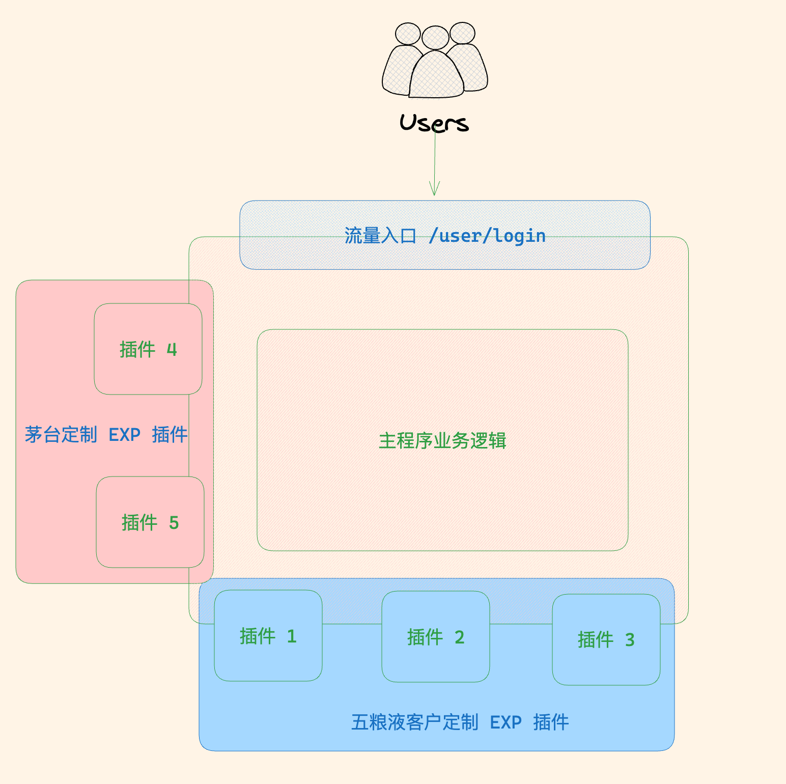
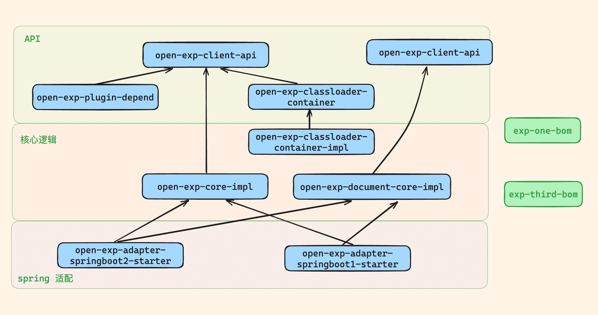

## EXP Introduction

Extension Plugin 扩展点插件系统


名词定义:

1. 主应用
    - exp 需要运行在一个 jvm 之上, 通常, 这是一个 springboot, 这个 springboot 就是主应用;
2. 插件
    - 扩展功能使用插件的方式支持
    - 插件里的代码写法和 spring 一样
3. 扩展点
    - 主应用定义的接口, 可被插件实现;
4. 热插拔
    - 插件支持从 jvm 和 spring 容器里摘除.
    - 支持运行时动态安装 jar 和 zip;

## 举例

- 贵州茅台和五粮液都购买了你司的标准产品, 但是. 由于客户有定制需求. 需要开发新功能.

- 贵州茅台客户定制了 2 个插件;
- 五粮液客户定制了 3 个插件;
- 程序运行时, 会根据客户的租户 id 进行逻辑切换.





场景:

1. B 端大客户对业务进行定制, 需要对主代码扩展.
    - 传统做法是 git 拉取分支.
    - 现在基于扩展点的方式进行定制, 可热插拔
2. 多个程序可分可合, 支持将多个 springboot 应用合并部署, 或拆开部署.
3. 支持扩展点类似 swagger 文档 doc, 用于类插件系统管理平台进行展示.

## Feature

1. 支持 spring 热插拔/启动时加载
2. 基于 classloader 类隔离
3. 支持多租户场景下的多实现, 各个实现可实时更新优先级
4. 支持 springboot2.x/1.x 依赖
5. 支持插件里对外暴露 Controller Rest, 可热插拔;

## USE

env:

1. JDK 1.8
2. Maven

```shell
git clone git@github.com:stateIs0/exp.git
cd all-package
mvn clean package
```

主程序依赖(springboot starter)

```xml
<dependency>
   <groupId>cn.think.in.java</groupId>
   <artifactId>open-exp-adapter-springboot2</artifactId>
</dependency>
```

插件依赖

```xml
<dependency>
   <groupId>cn.think.in.java</groupId>
   <artifactId>open-exp-plugin-depend</artifactId>
</dependency>
```

## 编程界面 API 使用

```java
@RequestMapping("/run")
public String run(String tenantId) {
  // 上下文设置租户 id
  context.set(tenantId);
  try {
      List<UserService> userServices = expAppContext.get(UserService.class);
      // first 第一个就是这个租户优先级最高的.
      Optional<UserService> optional = userServices.stream().findFirst();
      if (optional.isPresent()) {
          optional.get().createUserExt();
      } else {
          return "not found";
      }
      return "success";
  } finally {
      // 上下文删除租户 id
      context.remove();
  }
}


@RequestMapping("/install")
public String install(String path, String tenantId) throws Throwable {
  Plugin plugin = expAppContext.load(new File(path));

  sortMap.put(plugin.getPluginId(), Math.abs(new Random().nextInt(100)));
  pluginIdTenantIdMap.put(plugin.getPluginId(), tenantId);

  return plugin.getPluginId();
}

@RequestMapping("/unInstall")
public String unInstall(String pluginId) throws Exception {
  log.info("plugin id {}", pluginId);
  expAppContext.unload(pluginId);
  pluginIdTenantIdMap.remove(pluginId);
  sortMap.remove(pluginId);
  return "ok";
}
```

## 模块

1. [all-package](all-package) 打包模块
2. [bom-manager](bom-manager) pom 管理, 自身管理和三方依赖管理
    - [exp-one-bom](bom-manager%2Fexp-one-bom) 自身包管理
    - [exp-third-bom](bom-manager%2Fexp-third-bom) 三方包管理
3. [open-exp-code](open-exp-code) exp 核心代码
    - [open-exp-classloader-container](open-exp-code%2Fopen-exp-classloader-container) classloader 隔离 API
    - [open-exp-classloader-container-impl](open-exp-code%2Fopen-exp-classloader-container-impl) classloader 隔离 API
      具体实现
    - [open-exp-client-api](open-exp-code%2Fopen-exp-client-api) 核心 api 模块
    - [open-exp-core-impl](open-exp-code%2Fopen-exp-core-impl) 核心 api 实现
    - [open-exp-document-api](open-exp-code%2Fopen-exp-document-api) 扩展点文档 api
    - [open-exp-document-core-impl](open-exp-code%2Fopen-exp-document-core-impl) 扩展点文档导出实现
    - [open-exp-plugin-depend](open-exp-code%2Fopen-exp-plugin-depend) exp 插件依赖
4. [open-exp-example](open-exp-example) exp 使用示例代码
    - [example-extension-define](open-exp-example%2Fexample-extension-define) 示例扩展点定义
    - [example-plugin1](open-exp-example%2Fexample-plugin1) 示例插件实现 1
    - [example-plugin2](open-exp-example%2Fexample-plugin2) 示例插件实现 2
    - [example-springboot1](open-exp-example%2Fexample-springboot1) 示例 springboot 1.x 例子
    - [example-springboot2](open-exp-example%2Fexample-springboot2) 示例 springboot 2.x 例子
5. [spring-adapter](spring-adapter) springboot starter, exp 适配 spring boot
    - [open-exp-adapter-springboot2](spring-adapter%2Fopen-exp-adapter-springboot2-starter)  springboot2 依赖
    - [open-exp-adapter-springboot1-starter](spring-adapter%2Fopen-exp-adapter-springboot1-starter) springboot1 依赖

## 模块依赖




## 扩展

cn.think.in.java.open.exp.client.TenantCallback

```java
public interface TenantCallback {

   /**
    * 返回这个插件的序号, 默认 0; 
    * {@link  cn.think.in.java.open.exp.client.ExpAppContext#get(java.lang.Class)} 函数返回的List 的第一位就是 sort 最高的.
    */
   Integer getSort(String pluginId);

   /**
    * 这个插件是否属于当前租户, 默认是;
    * 这个返回值, 会影响 {@link  cn.think.in.java.open.exp.client.ExpAppContext#get(java.lang.Class)} 的结果
    * 即进行过滤, 返回为 true 的 plugin 实现, 才会被返回.
    */
   Boolean isOwnCurrentTenant(String pluginId);
}
```

示例代码:

````java
expAppContext.setTenantCallback(new TenantCallback() {
   @Override
   public Integer getSort(String pluginId) {
       // 获取这个插件的排序
       return sortMap.get(pluginId);
   }

   @Override
   public Boolean isOwnCurrentTenant(String pluginId) {
       // 判断当前租户是不是这个匹配这个插件
       return context.get().equals(pluginIdTenantIdMap.get(pluginId));
   }
});
````
