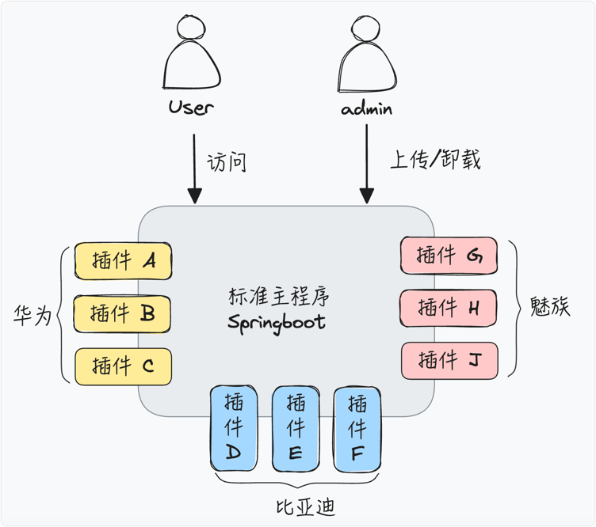

## ⭐️⭐️⭐️Introduction

🚕🚕🚕EXP (`Ex`tension `P`lugin) 扩展点插件系统


相关文章🎯🎯🎯[EXP 一款 Java 插件化热插拔框架](http://thinkinjava.cn/2023/08/15/2023/exp/)

名词定义:

1. 🏅主应用
    - exp 需要运行在一个 jvm 之上, 通常, 这是一个 springboot, 这个 springboot 就是主应用;
2. 🎖扩展点
    - 主应用定义的接口, 可被插件实现;
    - 注意：插件是扩展点的具体实现集合，扩展点，仅仅是接口定义。一个插件里，可以有多个扩展点的实现，一个扩展点，可以有多个插件的实现。
3. 🥇插件
    - 扩展功能使用插件的方式支持，你可以理解为 idea、eclipse 里的插件。
    - 插件里的代码写法和 spring 一样（如果你的程序是在 spring 里运行）
    - 插件是类隔离的,支持 parent-first 或 self-first 模式.
4. 🥈热插拔
    - 插件支持从 jvm 和 spring 容器里摘除.
    - 支持运行时动态安装 jar 和 zip;

## 🎧Example

- 贵州茅台和五粮液都购买了你司的标准产品, 但是. 由于客户有定制需求. 需要开发新功能.

- 贵州茅台客户定制了 2 个插件;
- 五粮液客户定制了 3 个插件;
- 程序运行时, 会根据客户的租户 id 进行逻辑切换.



场景:

1. B 端大客户对业务进行定制, 需要对主代码扩展.
    - 传统做法是 git 拉取分支.
    - 现在基于扩展点的方式进行定制, 可热插拔
2. 需要多个程序可分可合, 支持将多个 springboot 应用合并部署, 或拆开部署.
3. 扩展点类似 swagger 文档 doc, 用于类插件系统管理平台进行展示.

## Feature

1. 支持 热插拔 or 启动时加载(Spring or 普通 jvm)
2. 支持 Classloader Parent First + Self First 的类隔离机制(通过配置指定模式)
3. 支持多租户场景下的单个扩展点有多实现, 业务支持租户过滤, 租户多个实现可自定义排序
4. 支持 Springboot3.x/2.x/1.x 依赖
5. 支持插件内对外暴露 Spring Controller Rest, 可热插拔;
6. 支持插件覆盖 Spring 主程序 Controller.
7. 支持插件获取独有的配置, 支持自定义设计插件配置热更新逻辑;
8. 支持插件和主应用绑定事务.
9. 提供流式 api，使主应用在接入扩展点时更干净。
10. 支持插件 log 逻辑隔离, 支持 slf4j MDC, 支持修改插件 logger 名称
11. 提供类似 swagger 的文档注释, 可暴露 JSON 格式的扩展点文档
12. 提供 maven 辅助插件，可在打包时自动热部署代码，秒级部署新代码；

## USE

环境准备:

1. JDK 1.8
2. Maven

```shell
git clone git@github.com:stateIs0/exp.git
cd all-package
mvn clean package
```

主程序依赖(springboot starter)

```xml

<dependency>
    <groupId>cn.think.in.java</groupId>
    <!-- 这里是 springboot 2 例子, 如果是普通应用或者 springboot 1 应用, 请进行 artifactId 更换  -->
    <artifactId>open-exp-adapter-springboot2-starter</artifactId>
</dependency>
```

插件依赖

```xml
<dependency>
   <groupId>cn.think.in.java</groupId>
   <artifactId>open-exp-plugin-depend</artifactId>
</dependency>
```

## 编程界面 API 使用

```java
ExpAppContext expAppContext = ExpAppContextSpiFactory.getFirst();

public String run(String tenantId) {
   List<UserService> userServices = expAppContext.get(UserService.class, TenantCallback.DEFAULT);
   // first 第一个就是这个租户优先级最高的.
   Optional<UserService> optional = userServices.stream().findFirst();
   if (optional.isPresent()) {
       optional.get().createUserExt();
   } else {
       return "not found";
   }
}


public String install(String path, String tenantId) throws Throwable {
  Plugin plugin = expAppContext.load(new File(path));
  return plugin.getPluginId();
}

public String unInstall(String pluginId) throws Exception {
  log.info("plugin id {}", pluginId);
  expAppContext.unload(pluginId);
  return "ok";
}
```

## 模块

1. [all-package](all-package) 打包模块
2. [bom-manager](bom-manager) pom 管理, 自身管理和三方依赖管理
    - [exp-one-bom](bom-manager%2Fexp-one-bom) 自身包管理
    - [exp-third-bom](bom-manager%2Fexp-third-bom) 三方包管理
3. [open-exp-code](open-exp-code) exp 核心代码
    - [open-exp-classloader-container](open-exp-code%2Fopen-exp-classloader-container) classloader 隔离 API
    - [open-exp-classloader-container-impl](open-exp-code%2Fopen-exp-classloader-container-impl) classloader 隔离 API
      具体实现
    - [open-exp-client-api](open-exp-code%2Fopen-exp-client-api) 核心 api 模块
    - [open-exp-core-impl](open-exp-code%2Fopen-exp-core-impl) 核心 api 实现; 内部 shade cglib 动态代理, 可不以来 spring
      实现;
    - [open-exp-document-api](open-exp-code%2Fopen-exp-document-api) 扩展点文档 api
    - [open-exp-document-core-impl](open-exp-code%2Fopen-exp-document-core-impl) 扩展点文档导出实现
    - [open-exp-object-field-extend](open-exp-code%2Fopen-exp-object-field-extend) 字节码动态扩展字段模块
    - [open-exp-plugin-depend](open-exp-code%2Fopen-exp-plugin-depend) exp 插件依赖
4. [example](example) exp 使用示例代码
    - [example-extension-define](example%2Fexample-extension-define) 示例扩展点定义
    - [example-plugin1](example%2Fexample-plugin1) 示例插件实现 1
    - [example-plugin2](example%2Fexample-plugin2) 示例插件实现 2
    - [example-springboot1](example%2Fexample-springboot1) 示例 springboot 1.x 例子
    - [example-springboot2](example%2Fexample-springboot2) 示例 springboot 2.x 例子; 使用 spring cglib 动态代理
5. [spring-adapter](spring-adapter) springboot starter, exp 适配 spring boot
    - [open-exp-adapter-springboot2](spring-adapter%2Fopen-exp-adapter-springboot2-starter)  springboot2 依赖
    - [open-exp-adapter-springboot1-starter](spring-adapter%2Fopen-exp-adapter-springboot1-starter) springboot1 依赖
    - https://github.com/stateIs0/open-exp-springboot3 springboot3 依赖

## 模块依赖


## 核心 API

```java
public interface ExpAppContext {
   /**
    * 获取当前所有的插件 id
    */
   List<String> getAllPluginId();
   
   /**
    * 预加载, 只读取元信息和 load boot class 和配置, 不做 bean 加载.
    */
   Plugin preLoad(File file);
   
   /**
    * 加载插件
    */
   Plugin load(File file) throws Throwable;

   /**
    * 卸载插件
    */
   void unload(String pluginId) throws Exception;

   /**
    * 获取多个扩展点的插件实例
    */
   <P> List<P> get(String extCode);


   /**
    * 获取单个插件实例.
    */
   <P> Optional<P> get(String extCode, String pluginId);
}
```

## 流式 API

```java
/**
 * 流式 API, 优雅处理.
 *
 * @Author cxs
 **/
public interface StreamAppContext {

   /**
    * 简化操作, code 就是全路径类名
    */
   <P> List<P> streamOne(Class<P> pClass);

   /**
    * 针对有返回值的 api, 需要支持流式调用
    */
   <R, P> R streamList(Class<P> pClass, Ec<R, List<P>> ecs);

   /**
    * 针对有返回值的 api, 需要支持流式调用
    */
   <R, P> R stream(Class<P> clazz, String pluginId, Ec<R, P> ec);
}
```

## SPI 扩展

#### cn.think.in.java.open.exp.client.PluginFilter

可在获取实例过程中过滤`扩展点实现`

```java
public interface PluginFilter {

   <T> List<FModel<T>> filter(List<FModel<T>> list);

   @Data
   class FModel<T> {
      T t;
      String pluginId;

      public FModel(T t, String pluginId) {
         this.t = t;
         this.pluginId = pluginId;
      }
   }
}
```

````java
// 假如实现了 PluginFilter SPI 接口, 可进行自定义过滤
List<UserService> userServices = expAppContext.get(UserService.class);
// first 第一个就是这个租户优先级最高的.
Optional<UserService> optional = userServices.stream().findFirst();
````

#### cn.think.in.java.open.exp.client.PluginConfig

插件配置 SPI, 相较于普通的 config api, 会多出一个 pluginId 维度, 方便基线管理各个插件的配置

```java
public interface PluginConfig {
    String getProperty(String pluginId, String key, String defaultValue);
}
```

插件获取配置示例代码:

```java
public class Boot extends AbstractBoot {
    // 定义配置, key name 和 Default value;
   public static ConfigSupport configSupport = new ConfigSupport("bv2", null);
}
public String hello() {
   return configSupport.getProperty();
}
```

## 插件核心其他配置

springboot 配置项(-D 或 application.yml 都支持):

```java
plugins_path={springboot 启动时, exp主动加载的插件目录}
plugins_work_dir={exp 的工作目录, 其会将代码解压达成这个目录里,子目录名为插件 id}
plugins_auto_delete_enable={是否自动删除已经存在的 plugin 目录}
plugins_spring_url_replace_enable={插件是否可以覆盖主程序 url, 注意, 目前无法支持多租户级别的覆盖}
exp_object_field_config_json={插件动态增加字段json, json 结构定义见: cn.think.in.java.open.exp.object.field.ext.ExtMetaBean}
```


## 插件配置

1. [pluginMeta.properties](example%2Fexample-plugin-empty%2Fsrc%2Fmain%2Fresources%2FpluginMeta.properties)

```properties
# 插件 boot class
plugin.boot.class=cn.think.in.java.open.exp.example.empty.Boot
# code 名 不能为空
plugin.code=example.plugin.empty
# 描述
plugin.desc=this a plugin a empty demo
# 版本
plugin.version=1.0.0
# 扩展
plugin.ext=null
# 类加载模式,默认 parent-first
plugin.classLoader.mode=self-first
```

2. [extension.properties](example%2Fexample-plugin-b-v2%2Fsrc%2Fmain%2Fresources%2Fextension.properties)

扩展点映射

```properties
cn.think.in.java.open.exp.adapter.springboot2.example.UserService=\
  cn.think.in.java.open.exp.example.b.UserPlugin
```

## License

[Apache 2.0 License.](https://github.com/stateIs0/exp/blob/master/LICENSE)

## Stargazers over time

[](https://starchart.cc/stateIs0/exp)

